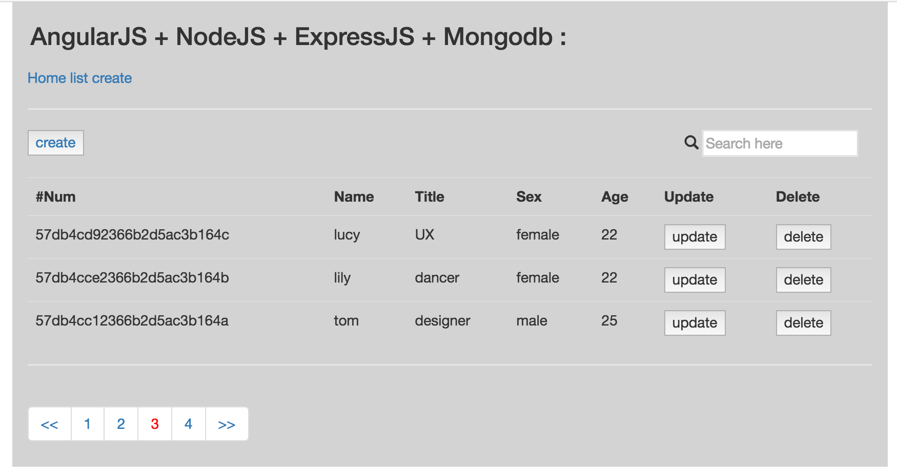

# User-Management-Demo

This simple user-management-demo mainly implemented:

  | Backend: basic CRUD functionalities by using NodeJS, ExpressJS, Mongoose and MongoDB.

  | Front-end: Filter, service and pagination by using AngularJS, Bootstrap, HTML and CSS.

